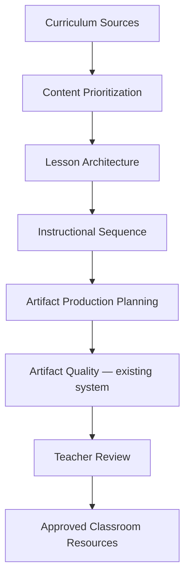

# Curriculum Production Engine Foundation

Last updated: 2026-07-28

Status: **Phase 5 manual intake active** — foundation plus teacher-controlled lesson package planning; no artifact generation.

## Phase 5 — Manual Curriculum Intake (complete)

Teacher-entered intake → content prioritization → artifact plan → validation → Lesson Package Plan.

Status command: `bin/chief-of-staff --lesson-package-status`

Guide: `docs/lesson-package-manual-intake-workflow.md`

## Purpose

The Curriculum Production Engine (CPE) orchestrates the path from teacher-approved curriculum sources to a complete, internally consistent lesson package. It sits **above** the existing Instructional Artifact Quality System (Phases 1–3), which remains unchanged.

## Architecture



| Layer | Role | This phase |
| --- | --- | --- |
| Curriculum sources | Approved inputs | Placeholder models only |
| Content prioritization | Critical → Omit tiers | Manual classification models |
| Lesson architecture | Canonical lesson model | Structured fields, no content generation |
| Instructional sequence | Reusable templates | ELA, math, history, reading |
| Artifact planning | Required artifacts + gates | Planning framework only |
| Artifact Quality | PASS/WARN/FAIL preflight | **Unchanged** — `--artifact-quality-status` |
| Teacher review | Human approval | Status tracking only |

## Module map

```text
scripts/curriculum_production/
  lesson_model.py          — canonical lesson structure
  content_map.py           — prioritization placeholders (no auto classify)
  lesson_sequence.py       — reusable sequence templates
  artifact_plan.py         — artifact planning scaffold
  relationship_graph.py    — lesson-package relationship model
  production_registry.py   — in-memory production tracking
  validation.py              — PASS/WARN/FAIL validators
```

Configuration: `configs/curriculum-production/`

Fictional fixtures: `fixtures/curriculum-production/` (planning samples only — not real curriculum)

Status: `bin/chief-of-staff --curriculum-production-status`

## Lesson model

Structured fields include lesson id, subject, grade, unit, chapter, lesson number, title, objective, standards, vocabulary, prerequisites, assessment targets, instructional sequence id, required artifacts, and production status.

No lesson body generation. Models serialize to/from dict for future tooling.

## Content prioritization

Every curriculum item will eventually classify into:

| Tier | Meaning |
| --- | --- |
| Critical | Must appear in student-facing artifacts |
| High Priority | Important across artifacts |
| Supporting | Optional context |
| Teacher Background | Teacher-only material |
| Omit | Exclude from package |

**Automatic classification is disabled.** Validators WARN when items lack manual priority.

Profile: `configs/curriculum-production/content-prioritization.yaml`

## Instructional sequence

Reusable templates (not generated lessons):

| Template | Steps |
| --- | --- |
| ELA | I Do → We Do → Student Check → Guided Practice → Independent Practice → Closure |
| Math | Concrete → Model → Guided → Independent → Spiral → Exit Ticket |
| History | Hook → Vocabulary → Background → Primary Source → Guided Notes → Practice → Closure |
| Reading | Word Attack → Vocabulary → Teacher Read → Partner → Independent → Written Response |

Catalog: `configs/curriculum-production/instructional-sequences.yaml`

## Artifact planning

Standard lesson artifact chain:

```text
Presentation → Guided Notes → Worksheet → Teacher Script → Vocabulary
→ Assessment → Teacher Key → Review
```

Each planned artifact tracks: status, dependencies, validation state, required subject, Artifact Quality profile gate, and approval flag.

**Artifacts are not generated in this phase.**

## Relationship graph

Required relationships (validated):

| Source | Relationship | Target |
| --- | --- | --- |
| Presentation | matches | Guided Notes |
| Worksheet | depends on | Lesson Objective |
| Assessment | covers | Critical Content |
| Teacher Key | mirrors | Student Resource |
| Vocabulary | feeds | Guided Notes |
| Review | covers | Assessment Targets |

Graph validation FAILs when required edges are missing.

## Production registry

In-memory registry tracks per lesson:

- planned / completed / validated / approved artifacts
- quality status (from future Artifact Quality runs)
- teacher review status
- production status

No database. No real curriculum ingestion.

## Future phases (planned only)

| Phase | Scope | Status |
| --- | --- | --- |
| Manual curriculum extraction | Named source paths, teacher review | Not implemented |
| Manual content prioritization UI/workflow | Assign Critical → Omit | Not implemented |
| Teacher approval workflow | Gate before classroom use | Not implemented |
| Artifact generation | Bounded builders | Not implemented |
| Automatic consistency checking | Cross-artifact diff | Not implemented |
| Lesson package assembly | Export classroom bundle | Not implemented |

## Boundaries

- No lesson generation
- No Canvas
- No Google Drive scanning
- No real curriculum ingestion
- No APIs or network
- No OCR, embeddings, or AI generation
- No student information
- Artifact Quality Phases 1–3 unchanged

## Related docs

- Instructional Artifact Quality: `docs/instructional-artifact-quality-foundation.md`
- Build queue: `docs/build-queue.md`
- Master roadmap: `docs/master-build-roadmap.md`
