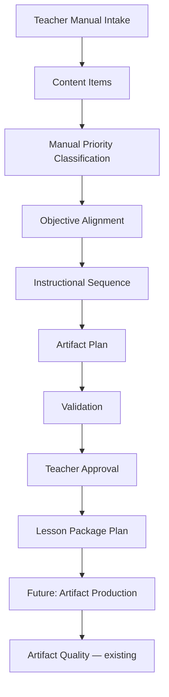

# Lesson Package Manual Intake Workflow

Last updated: 2026-07-28

Status: **Phase 5 complete** — manual intake through validated Lesson Package Plan; no artifact generation.

## Workflow



## Manual curriculum intake

Teachers enter structured metadata locally:

- Lesson ID, subject, grade, unit, chapter, lesson number, title
- Objective, standards, vocabulary, assessment targets
- Teacher notes and source references
- Approval status

No OCR, file parsing, Drive scanning, or automatic extraction.

Module: `scripts/curriculum_production/curriculum_intake.py`

## Content items

Each item includes ID, title, description, source reference, priority, subject, tags, teacher notes, approval state, validation state, and links to objectives, assessment targets, and sequence steps.

Priority assignment is **always manual**.

Module: `scripts/curriculum_production/content_map.py`

## Priority workflow

| Tier | Use |
| --- | --- |
| Critical | Must support objective or assessment target |
| High Priority | Important; source reference recommended |
| Supporting | Optional context; count limits apply |
| Teacher Background | Teacher-only material |
| Omit | Exclude from student artifacts |

Configuration: `configs/curriculum-production/priority-limits.yaml`

## Validation rules

**FAIL when:**

- Required intake fields missing
- Critical item does not support objective or assessment target
- Required relationship graph edges missing

**WARN when:**

- High Priority items lack references
- Supporting items exceed configured limit
- Teacher Background dominates the map
- Omit items appear in artifact planning
- Assessment targets lack supporting Critical content
- Teacher approval still Draft or In Review

Module: `scripts/curriculum_production/intake_validation.py`

## Teacher approval

States: Draft → In Review → Approved → Archived

Approved lessons cannot return to Draft without explicit override. Approval records capture timestamp, user, and note (local models only).

Module: `scripts/curriculum_production/approval_workflow.py`

## Lesson Package Plan

Output includes metadata, objectives, vocabulary, critical content, instructional sequence, artifact plan, validation summary, approval status, teacher notes, and formatted status report.

**No generated worksheet, presentation, or classroom files.**

Build command (Python):

```python
from pathlib import Path
from scripts.curriculum_production.fixture_loader import build_from_fixture

package = build_from_fixture(Path("fixtures/curriculum-production/passing/math-lesson-package.json"))
print(package.status_report)
```

## Status report example

```text
Lesson Package Status
---------------------

Lesson: PASS
Objectives: PASS
Critical Content: PASS
Vocabulary: PASS
Instructional Sequence: PASS
Artifact Plan: PASS
Teacher Approval: Draft

Overall: WARN
```

## Chief of Staff

```bash
bin/chief-of-staff --lesson-package-status
```

## Future automation boundaries (planned only)

- AI-assisted prioritization
- Lesson generation
- Artifact generation
- Consistency engine
- Package assembly export

These remain **not implemented**.

## Related

- CPE foundation: `docs/curriculum-production-engine-foundation.md`
- Artifact Quality: `docs/instructional-artifact-quality-foundation.md`
